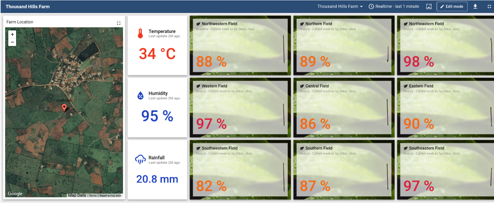
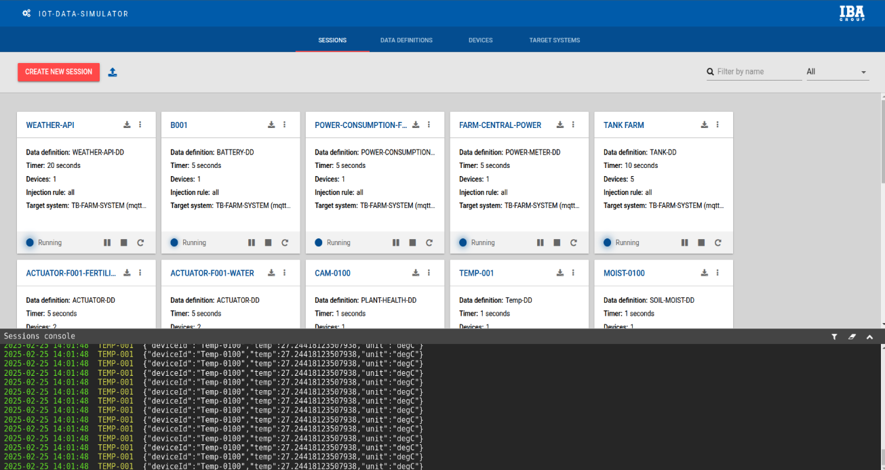
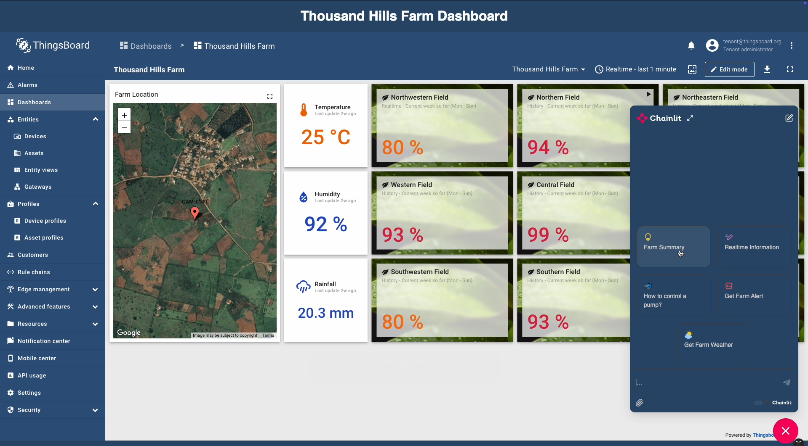
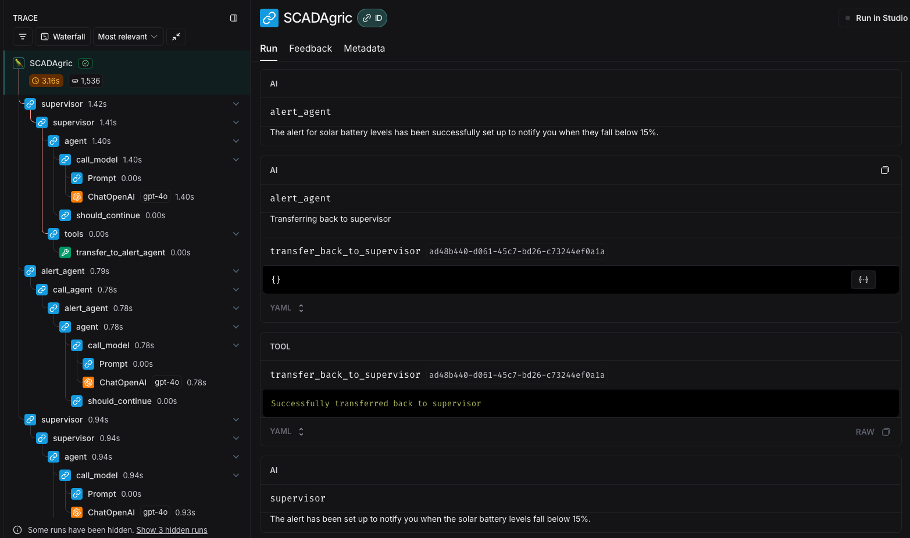

# Agentic Farm Monitoring
[Add the Abstract and Objective Here]
## Team Member: 
- D’Amour Nsanzimfura  
- Claude Kwizera  
- George Igwegbe  
- Martins Awojide 

## Project Resource: 
- Slide - [Link](https://docs.google.com/presentation/d/1I3JV1gkgichxwABez41WdOuUcY8so8x_/edit?slide=id.g35690ed8853_14_3#slide=id.g35690ed8853_14_3)
- Report - [Link](#)
- Video - [Link](#)


## Project Structure 
- **`cloud-integration/`** – Codebase for the initial cloud setup and deployment.  
- **`llm/`** – Codebase for running the large language model (LLM) components.  
- **`simulated-farm-setup/`** – Code for setting up the simulated farm model and integrating with ThingsBoard.  
- **`farm-eda/`** – Exploratory data analysis (EDA) for the Nyagatare Farm in Eastern Province.

To run the project, first complete the setup for ThingsBoard and the IoT Simulator. Once those are configured, you can proceed to set up the agent services and the Flask integration app.

## Initial Setup (Thingsboard and IoT Simulator)
To get started with the ThingsBoard and IoT Simulator setup, follow the respective instructions below:
- **Thingboard Board Database Setup** - [Instructions](https://github.com/gigwegbe/function-calling-for-sensors-at-the-edge/tree/main/simulated-farm-setup/thingsboard/database) 
- **Thingboard Board Dashboard Configuration** - [Instructions](https://github.com/gigwegbe/function-calling-for-sensors-at-the-edge/tree/main/simulated-farm-setup/thingsboard/dashboard) 
- **IoT Simulator Board Devices Setup** - [Instructions](https://github.com/gigwegbe/function-calling-for-sensors-at-the-edge/tree/main/simulated-farm-setup/thingsboard/devices)


Once you've completed the ThingsBoard and IoT Simulator setup, your environment should resemble the screenshots shown below:

### ThingsBoard Dashboard



### IoT Simulator Configuration



## Agent Services & Flask Integration App

Follow the steps below to run the agent services and the Flask integration app:

1. **Clone the Repository**  
   Ensure your working directory is set to the `llm` folder.

2. **Install Python**  
   Make sure Python `3.11` or higher is installed on your system.

3. **Set Up a Virtual Environment**  
   ```bash
   python3.11 -m venv myenv
   source myenv/bin/activate 
   ```

4. Install Dependencies
    ```bash 
    pip install -r requirements.txt
    ```
5. Create a `.env` file and set the following environment variables for your API keys and access tokens:
    ```bash
TAVILY_API_KEY="tvly-*****"
LANGSMITH_API_KEY="lsv2_*******"
OPENAI_PROJECT_API_KEY='sk-******'
LANGSMITH_PROJECT="SCADAgri-Visualization"
OPENWEATHERMAP_API_KEY='*************'
    ```

1. Run the Agent(Chainlit Interface)
    ```bash 
    chainlit run sensor_chat_supervisor_agent.py -w --port 8000
    ```
2. Run the Flask Intergation App 
   This app embeds the Chainlit chat interface inside ThingsBoard.
   ```bash
    python3 app.py
   ```

After running the commands above, open your browser and navigate to `http://localhost:5000`. You should see a page similar to the screenshot below:


## Performance and Evaluation

To test and evaluate the agent's behavior using LangGraph and LangSmith:

1. **Start the LangGraph development server**  
   ```bash
   langgraph dev
   ```

2. View the Agent's LangGraph. Open the following URL in your browser:
    ```bash
    http://127.0.0.1:2024
    ```
3. Then navigate to LangSmith Studio to Test the agent. 





